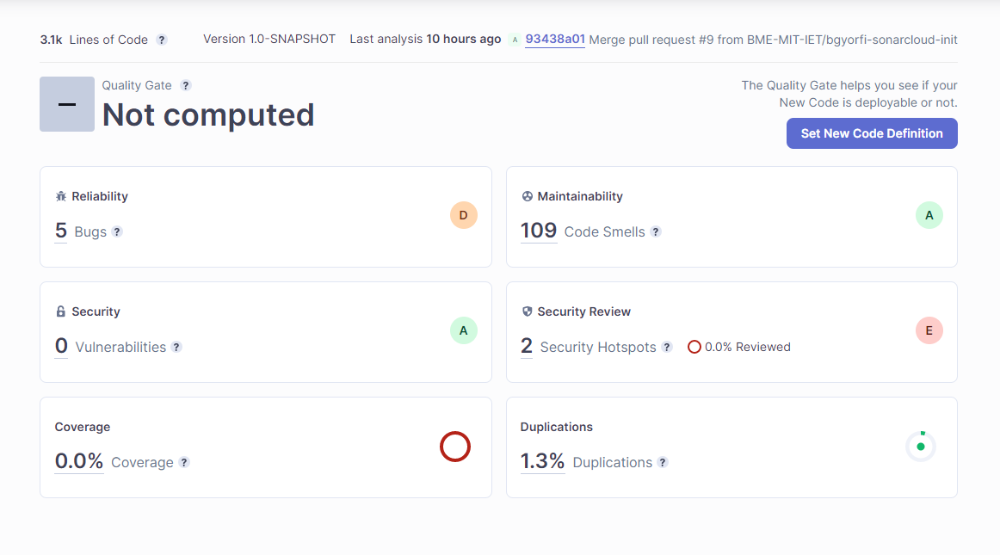
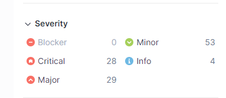
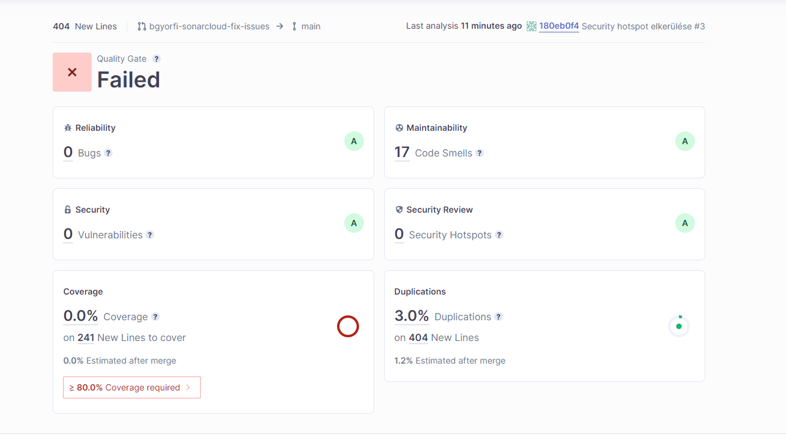

# Statikus analízis végzése a projekten
(Györfi Bence)

## A kód áttekintése manuálisan

Az első probléma ami rögtön szembe jött, hogy a file-ok nincsenek package-ekbe rendezve, ami jelentősen megnehezíti az áttekinthetőséget.
Így a felelősségek nincsenek szépen elosztva. Maximum a fileok neveire hagyatkozhatunk.

A kommentezést sem tartom megfelőnek. Például az Agent osztály esszé szerűen van kommentezve, ami nem követi a @javadoc konvenciókat.

**Apróbb hibák:**

- Skeleton osztályban exit == false helyett exit! vagy starts == true helyett starts
- És sok más helyen van még ilyen!

## Statikus Analízis implementálása

Rögtön problémába ütköztem, mivel nem volt hozzáférésem a repository-hoz a SonarCloudon keresztül. De ezt gyorsan megkaptam, így miután a gradlet sikeresen beletetette @szarvasd a workflow-ba, én is munkához láttam.

Kiegészítettem a gradle.yml-t a sonarcloudon írt lépésekkel és felvettem Githubra a SonarCloud által adott Secret Tokent.
Nyitottam egy Pull Requestet, amit @safardani mergelt a Main-be. Az új workflow sikeresen lefutotott és a SonarCloud oldalán megtekinthettem az analízis eredményét.

## Kezdeti eredmény:

*A problémák súlyossága:*

## A javítási stratégia:

Először mindenképp a 'Critical' és 'Major' problémákat nézem át, ezek közül is a Bug-okat és a Security Hotspotokat először.

**Security Hotspot:**

A SonarCloud szerint a 'java.util.Random' használata kiszámítható eredménye kiszámítható lehet egy felkészült támadó esetén így javasolja a 'java.security.SecureRandom' használatát, ami egy kriptografikailag erős randomgenerátor. Mivel az alkalmazás csak egy játék és a randomgenerátort nem kényes esetekre (pl. jelszó hashelése) használom, így nem szükséges szerintem a javasolt cserét elvégezni.

**Bugs**:

A bug részen 3 potenciális nullpointerexceptionre hívja fel a figyelmet valamint a korábban említett 2 Random használatra.
A 'NullPointerException' legjobb esetben csak terminálja a programot, de rosszabb esetben pedig debuginformációkat szolgáltathat támadóknak. Lehetővé teszi a támadók számára a biztonsági intézkedések megkerülését. Ez az eset a játék esetén ugyan nem áll fent, de a ezeket jobbnak látom javítani.

- A két 'NullPointerExceptiont' egy try-catchbe zártam.

Kérdéses:

- *Controller osztály - refreshView()* Mi van akkor ha a virologist null?

**Critical severitys**

- String erőforrások kiszervezése a ChoreaVirusGene, MemoryLossVirusGene és ParalyzingVirusGene osztályokban.
- A kognitív komplexitását kell csökkenteni a Controller HandleUserInput függvényének.
- String erőforrás kiszervezése a Controller és Prototype osztályban.
- *Field osztályban* üres implementációval van a clearMaterial -> jogos mivel a Field önmagában is létezhet, így egy field collection-ön iterálva meg lehet hívni rajta a clearMaterialt() és annak semmilyen hatása nem kell legyen.
- default case a switchez

- Számos ilyen string kiszervezést pedig bennehagytam, mert főleg demonstráció miatt ctrl-c ctrl-v jeleggel került bele a prototípusba.

Kérdéses:

- *InventoryPanel* osztály -> Make "geneticCodes", "geneticCodeCollection", "data" transient or serializable.
- *NeighborFieldsPanel* osztály -> Make "neighborFields" transient or serializable

**Major severitys**

- Absztakt osztályoknak nem kell publikus konstruktora legyen. Ezért sok helyen ezt protected-re cseréltem.
- @Override annotáció elhelyezése javít az olvashatóságon.
- A nem  használt függvényparamétereket nem töröltem, mert akkor mélyebben bele kellett volna nyúlni a kódba.
- NullPointerException-öket már korábban javítottam.

**Minor severitys**

Itt nem javítottam minden lehetséges hibából hanem csak szemezgettem:

- A névkonvenciókat követve lecseréltem változóneveket, hiszen ez fontos eleme a csapatmunkának.
- Érdekességet is megtudtam a vizsgálat közben, miszerint egy while ciklus összesen max. 1 db break és continue utasítást tartalmazhat, különben rossz a logika. Ezen el is gondolkodtam és most már értem a mögöttes logikát.
- A String Builder használata kisebb erőforrást igényel, mintha hozzáfűzünk a stringhez.
- A UserSelection osztályváltozóit priváttá tettem, hiszen csak így teljesítik az egységbe zártság törvényét. Getter-Setter elérhetőek.

## Összegzés

A statikus analízis csupán külsőleg és fogalmilag javított a kódunkon, több programozási törvényt betartatva velünk.

A logikai hibákat viszont nem fogja megtalálni, ehhez nekünk kell architektűrálisan jól tervezni.

# UPDATE

3 commit után sikerült 4 kategóriára 'A' értékelést kapni.

Természetesen a kódlefedettség nem tud megvalósulni, hiszen pl. a korábbi prototípus függvényei nincsenek használva.

Íme a jelenlegi report:

